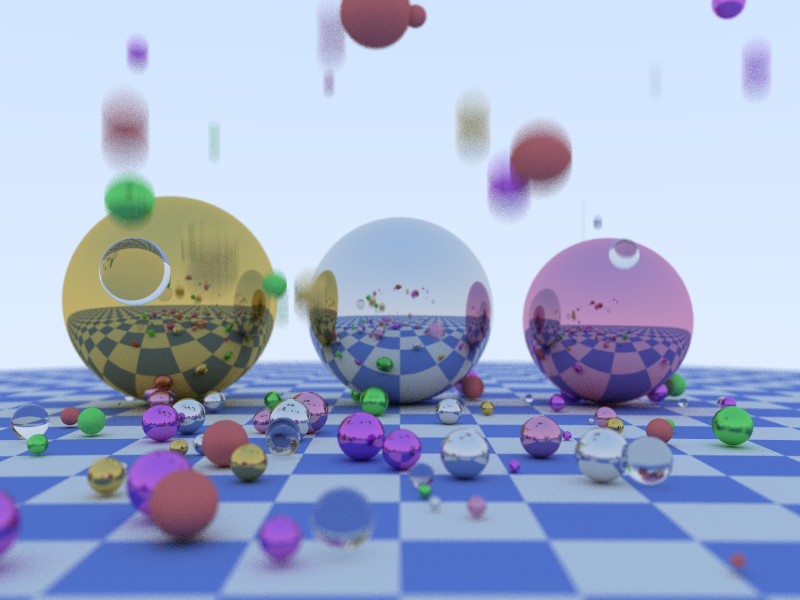
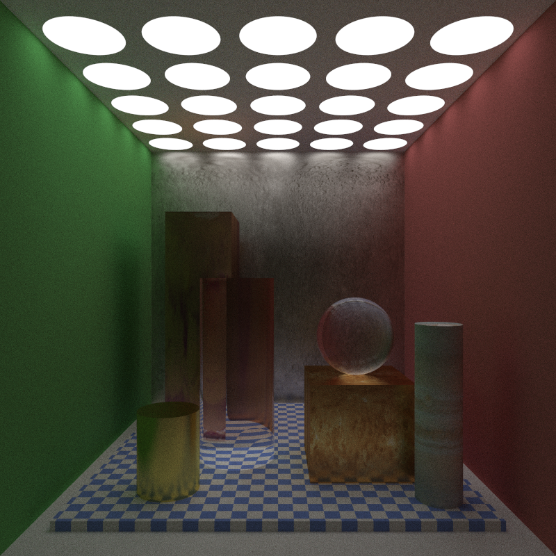
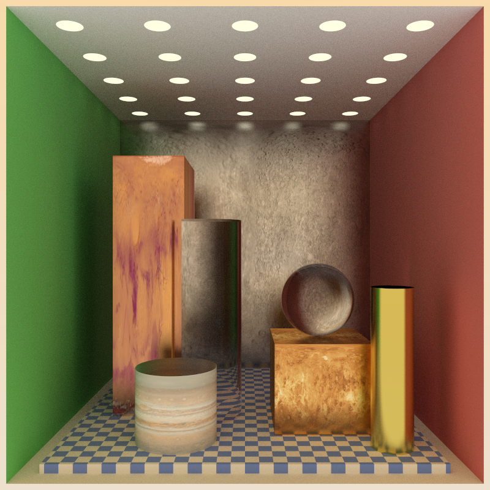
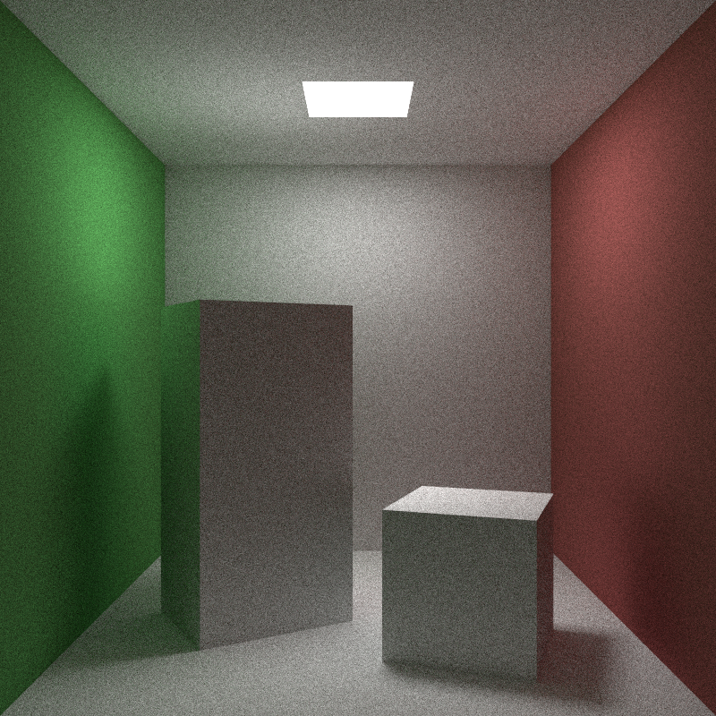
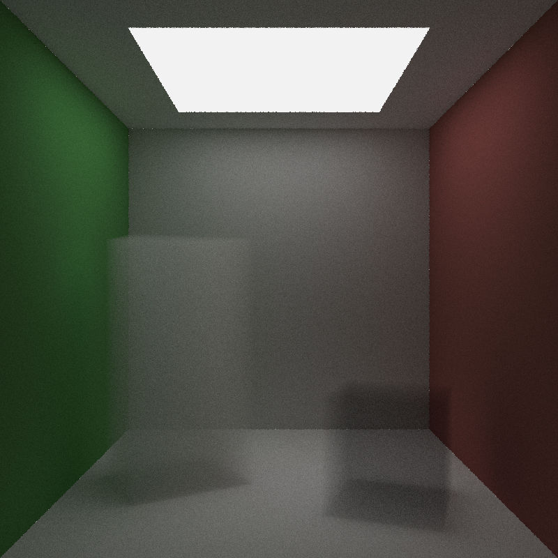

# Ray tracer

## Install
- Configure and generate makefile from CMakeLists.txt ([Tutorial](https://cmake.org/cmake-tutorial/))
- run "install.sh"

## Features
- MSAA
- Depth of field
- TBB parallelization
- Motion blur
- BVH Acceleration structure
- Solid texture
- Direct lighting
- Importance sampling

## Scene: 

	Camera: 
		Aspect: 1.33333
		FOV: 40
		Aperture: 0.02
		Focus distance: 3.36749
	104 objects
	7 materials

## Performance

For 800x600 image, with 100 samples / pixel, 50 recursive depth:

	* Without parallelization
		Render took 88 seconds

	* With parallelization
		Render took 27 seconds

	* With BVH acceleration
		Render took 16 seconds

## Scene: 

Assortments of ray-objects intersection, with 2 different lighting scenarios:

# Uniform sampling

# Homogeneous media

# Credit:
- [Physically based rendering](http://www.pbr-book.org/) by Matt Pharr, Wenzel Jakob, and Greg Humphreys
- Code based from ["Ray Tracing in One Weekend"](http://in1weekend.blogspot.com/) by [Peter Shirley](https://twitter.com/Peter_shirley).
- stb_image library: https://github.com/nothings/stb
- tbb: https://www.threadingbuildingblocks.org/
- Pluto texture: https://planet-texture-maps.fandom.com/wiki/Pluto
- Mars texture: https://planet-texture-maps.fandom.com/wiki/Mars
- Mercury texture: https://planet-texture-maps.fandom.com/wiki/Mercury
- Venus, Saturn textures: https://www.solarsystemscope.com/textures/
