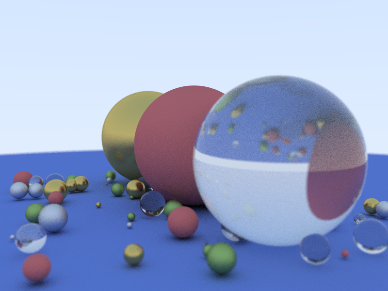

# Ray tracer

Referenced from ["Ray Tracing in One Weekend"](http://in1weekend.blogspot.com/) by [Peter Shirley](https://twitter.com/Peter_shirley).

## Features
- MSAA
- Depth of field
- TBB parallelization

## Scene: 
	Camera: 
		Look from: -3, 0.3, 1.5
		Look at: 0, 0, 0
		Aspect: 1.33333
		FOV: 40
		Aperture: 0.02
		Focus distance: 3.36749
	104 objects
	7 materials

## Stat

For 800x600 image, with 100 samples / pixel:

	_Without parallelization_
		Render 800x600 image took 88917 ms

	_With parallelization_
		Render  took 25803 ms

