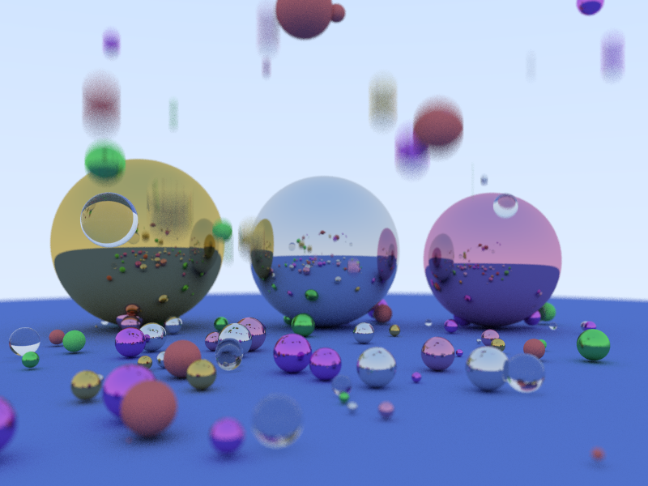

# Ray tracer

Referenced from ["Ray Tracing in One Weekend"](http://in1weekend.blogspot.com/) by [Peter Shirley](https://twitter.com/Peter_shirley).

## Install
- Configure and generate makefile from CMakeLists.txt ([Tutorial](https://cmake.org/cmake-tutorial/))
- run "install.sh"

## Features
- MSAA
- Depth of field
- TBB parallelization
- Motion blur
- BVH Acceleration structure

## Scene: 

	Camera: 
		Look from: -3, 0.3, 1.5
		Look at: 0, 0, 0
		Aspect: 1.33333
		FOV: 40
		Aperture: 0.02
		Focus distance: 3.36749
	104 objects
	7 materials

## Performance

For 800x600 image, with 100 samples / pixel, 50 recursive depth:

	* Without parallelization
		Render took 88 seconds

	* With parallelization
		Render took 27 seconds

	* With BVH acceleration
		Render took 16 seconds

